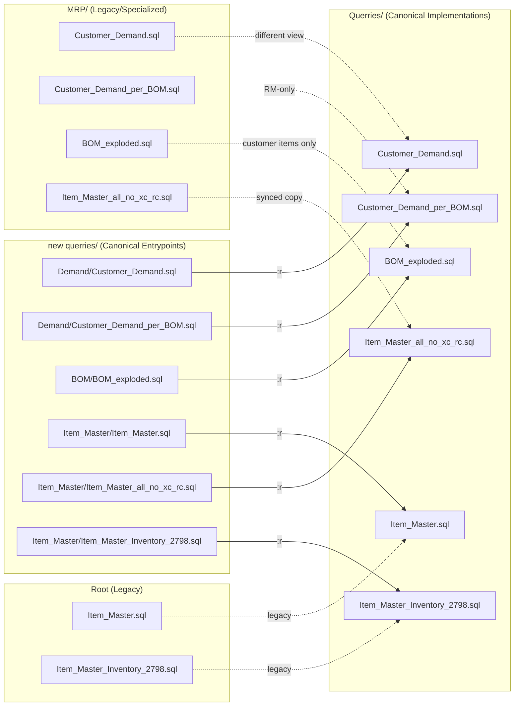
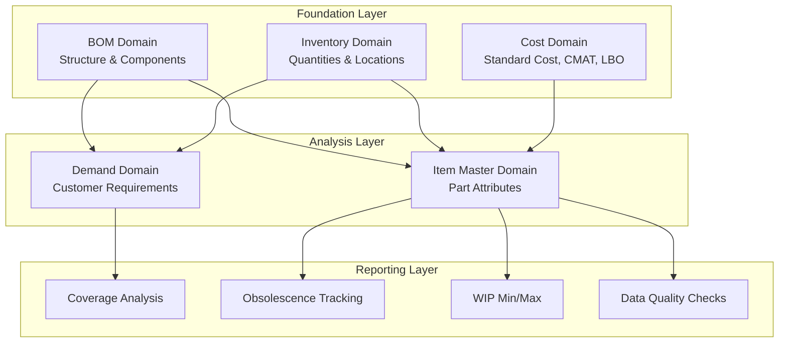
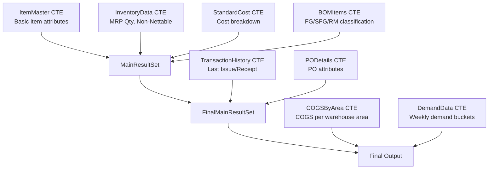

# Query & Data Flow Diagrams

This document contains mermaid diagrams that visualize the data sources, query dependencies, and canonical vs legacy query mappings.

---

## 1. Data Source & Domain Dependencies

Shows how QADEE2798 database feeds the canonical queries across different domains.

```mermaid
graph TD
    subgraph "QADEE2798 Database"
        PT[pt_mstr<br/>Item Master]
        PS[ps_mstr<br/>BOM Structure]
        SOD[sod_det<br/>Sales Order Detail]
        SCH[sch_mstr + active_schd_det<br/>Schedules]
        LD[ld_det<br/>Location Detail]
        XZ[xxwezoned_det<br/>Warehouse Zones]
        INV[15 / in_mstr<br/>Inventory]
        SCT[sct_det<br/>Standard Cost]
        TR[tr_hist<br/>Transaction History]
        PO[pod_det + po_mstr<br/>Purchase Orders]
        SO[so_mstr<br/>Sales Orders]
        SER[ser_active_picked<br/>Serials]
    end

    subgraph "Canonical Queries"
        CD[Customer_Demand]
        CDBOM[Customer_Demand_per_BOM]
        BOMX[BOM_exploded]
        IM[Item_Master]
        IMALL[Item_Master_all_no_xc_rc]
        IMINV[Item_Master_Inventory_2798]
    end

    PT --> IM
    PT --> IMALL
    PT --> IMINV
    PS --> BOMX
    PS --> IM
    PS --> IMALL
    SOD --> CD
    SOD --> CDBOM
    SCH --> CD
    SCH --> CDBOM
    LD --> IM
    LD --> IMALL
    LD --> IMINV
    XZ --> IM
    XZ --> IMALL
    XZ --> IMINV
    INV --> CD
    INV --> IM
    INV --> IMALL
    INV --> IMINV
    SCT --> IM
    SCT --> IMALL
    SCT --> IMINV
    TR --> IM
    TR --> IMALL
    TR --> IMINV
    PO --> IM
    SO --> CDBOM
```

---

## 2. Canonical vs Legacy Query Mapping

Shows which queries are canonical (in `new querries/`) and which are legacy/specialized.

---

## 3. Domain Hierarchy

Shows how the query domains relate to each other.

---

## 4. Query Execution Flow (Item Master example)

Shows the CTE flow within the canonical Item_Master query.

---

## Notes

- All diagrams use **QADEE2798** as the single data source (QADEE/2674 removed).
- Dashed lines indicate legacy or specialized relationships.
- Solid lines indicate canonical relationships.
- The `:r` notation indicates SQLCMD include directive.
